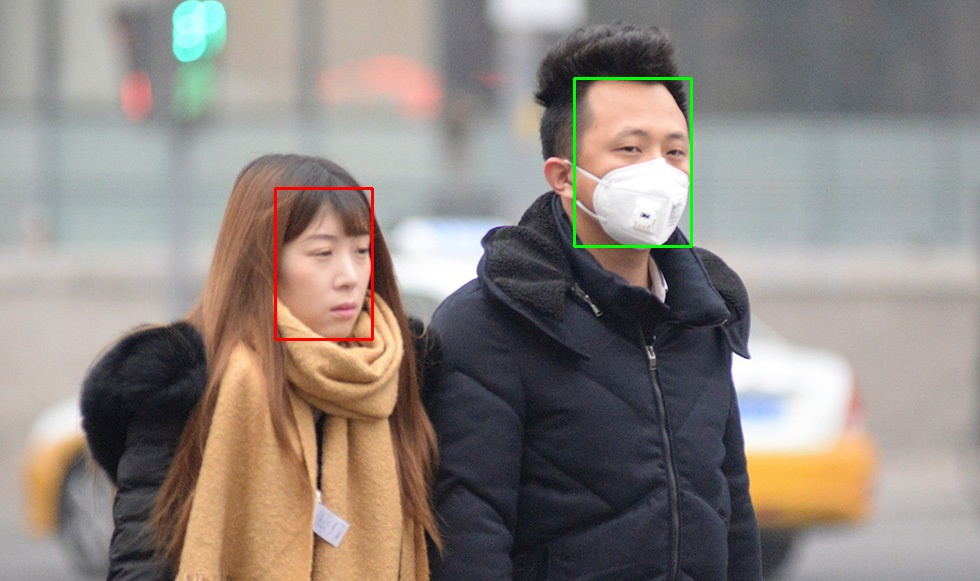

> **文档介绍**：
> 
> 本篇文档主要讲述算法SDK的制作与发布测试使用，会涉及到一些基础的linux命令、编译原理等(面向开发人员)。
> 
> 文档主要分三个部分：
> 1. 项目总体结构概述
> 2. SDK制作
> 3. SDK发布与测试
> 
> 下面依次介绍。

# 任务背景
&emsp; 通常情况下，业内基于深度学习模型的训练都是基于Python环境的，但是在生产环境中的前后端开发通常使用的是C++语言，这就涉及到如何将Python环境下训练好的模型转换为在C++环境下做推理。本文以使用PyTorch深度学习框架训练的一个戴口罩人脸二分类模型为例(未戴口罩以及戴口罩分为1类)，讲述如何将Python环境下PyTorch训练好的模型转换在C++环境下做推理，并将C++代码封装成SDK，以方便前后端开发人员调用。

开发环境：Ubuntu 16.04，OpenCV 4.3.0，CMake 3.6.3，pytorch 1.2.0（libtorch 1.5）


<br><br>

# 1. 项目结构概述
&emsp; 当您拿到该项目后，进入该项目目录，您将看到两个文件夹 cppml_sdk、 cppml_sdk_test 和一个 README 文件，其中 cppml_sdk 是我们用于制作SDK的目录，里面包含了所有算法源代码以及用于生成静态库的cmake编译文件(其实也算是代码文件)；而cppml_sdk_test是用于对外发布制作好的sdk以及测试代码目录。本文将详细介绍这两个目录的作用。

&emsp; 这个SDK的**主要用途是讲述如何将pytorch训练的好模型转换在c++环境下进行推理**，这里以一个简单的戴口罩分类为例来阐述这一过程（本代码实现的**基本功能就是戴口罩分类**，这一点从 gc_face_sdk.h 头文件也可以看出）。

> **README 是什么？**
> 顾名思义，README 就是 **read me (读我)**，当您拿到一个项目或者一份源代码，您不知道从和开始时，您就可以先阅读 README 文件。有些项目不但主目录有 README 文件，子目录也有 README 文件，这是为了方便您快速理解不同目录的用途。
> 
> 
> **cmake 是什么？**
> cmake 就是针对跨平台开发问题所设计的工具：它首先允许开发者编写一种平台无关的 CMakeList.txt 文件来定制整个编译流程，然后再根据目标用户的平台进一步生成所需的本地化 Makefile 和工程文件，如 Unix 的 Makefile 或 Windows 的 Visual Studio 工程。从而做到“Write once, run everywhere”。显然，CMake 就是一个高级的编译配置工具。一些使用 CMake 作为项目架构系统的知名开源项目有 VTK、ITK、KDE、OpenCV、OSG 等。(如您对 cmake 的工作机理感兴趣，请参阅文献[1])
> 
> 在 linux 平台下使用 CMake 生成 Makefile 并编译的流程如下：
> 1. 编写 CMake 配置文件 CMakeLists.txt 。
> 2. 执行命令 cmake PATH 或者 ccmake PATH 生成 Makefile（ccmake 和 cmake 的区别在于前者提供了一个交互式的界面）。其中， PATH 是 CMakeLists.txt 所在的目录。
> 3. 使用 make 命令进行编译。

主目录结构如下：
```bash
.
├── cppml_sdk         # 算法源代码以及sdk制作目录
├── cppml_sdk_test    # sdk发布以及测试目录
└── README.md         # 该目录下的README文件
```


项目使用总体步骤：\
**step1**:
先用 cppml_sdk 将代码编译成静态库

**step2**:
然后到 cppml_sdk_test 目录下测试，最终发布给前后端的是 cppml_sdk_test

下面将详细介绍其中的每一步。

<br><br>

# 2. SDK制作

## 2.1 将Python模型转换为C++模型
&emsp; PyTorch的主要接口为Python。虽然Python有动态编程和易于迭代的优势，但在很多情况下[1]，正是Python的这些属性会带来不利。我们经常遇到的生产环境，要满足低延迟和严格部署要求。对于生产场景而言，C++通常是首选语言，也能很方便的将其绑定到另一种语言，如Java，Rust或Go。本节主要介绍将PyTorch Python训练好的模型移植到C++中调用。有关这一内容的更多介绍可以参考文献 [4].
&emsp; 下面通过 tracing 来将 PyTorch 模型转换为 Torch 脚本, 必须将模型的实例以及样本输入传递给 torch.jit.trace 函数。这将生成一个 torch.jit.ScriptModule 对象，该对象会在前向推理中跟踪模型graph的执行过程。这一过程的主要步骤其实只有3大步，具体如下面代码所示：
```python
import torch
from torch.functional import F
from torchvision.models.mobilenet import mobilenet_v2
# from libml.models.mobilenet import MobileNetV1
from config import cfg_net


# ====================== STEP 1: 加载训练好的模型==========================
BATCH_SIZE = cfg_net['batch_size']
DEVICE = 'cpu'  # cfg_net['device']

# 输出图片尺寸
input_size = 96

# 定义模型运行设备
device = torch.device(DEVICE)  # cpu, cuda:0

# 定义模型
# net = MobileNetV1(num_classes=2)  # .to(device)
net = mobilenet_v2(num_classes=2, width_mult=0.35, inverted_residual_setting=None, round_nearest=8)  # .to(device)

# 加载已经训练好的模型
model_path = '/disk1/home/xiaj/dev/proml/maskface/save_model/20200402-235510-mobilenet_v2/acc0.9540-loss0.0043-epoch102.pth'
# model_path = '/home/xiajun/dev/proml/maskface/save_model/20200327-052039-mobilenet_v1/acc0.9565-loss0.0043-epoch112.pth'
net.load_state_dict(torch.load(model_path, map_location=device))


# ====================== STEP 2: 使用torch.jit.trace做一次前向推理 ==========================
# 设置为验证模型
net.eval()

# 生成一个样本供网络前向传播 forward()
example = torch.rand(1, 3, input_size, input_size)

# 使用 torch.jit.trace 生成 torch.jit.ScriptModule 来跟踪
traced_script_module = torch.jit.trace(net, example)
outputs = traced_script_module(torch.ones(1, 3, input_size, input_size))
outputs = F.softmax(outputs)
print(outputs)

# ====================== STEP 2: 保存模型 ==========================
traced_script_module.save("model_name.pt")
print("\nSave Success!!!\n")
```

## 2.2 C++ 环境搭建
linux下的程序开发，您都需要先搭好合适的环境，这里我们只需要opencv和pytorch的release版代码即可，而pytorch release代码可以到官网[3]去下载，所以这里您只需要安装一下opencv的c++环境就可以了。在linux下打开命令行终端，依次执行以下命令即可。

**step1**: 安装opencv \
这里推荐使用最新的 4.3.0 版，下载地址：https://github.com/opencv/opencv

```bash
sudo apt-get install cmake
# 有时需要显示窗口，还是一起更新了吧。
sudo apt-get install libgtk2.0-dev pkg-config
 
mkdir build
 
cd build
 
# cmake ..
cmake -D CMAKE_BUILD_TYPE=Release -D CMAKE_INSTALL_PREFIX=/path to your/opencv-4.3.0/static_install -D WITH_CUDA=OFF -D BUILD_SHARED_LIBS=NO ..
 
# make 编译
make -j4

# make 安装
sudo make install
```

**step2**: 下载 libtorch \
下载地址：https://pytorch.org/ \
下载下来放到您任意指定的目录下即可，不需要做任何编译。

<br>

## 2.3 静态库编译与测试
当您搭建好开发环境之后，我们就可以来制作SDK了。本节我们来介绍 cppml_sdk 目录下的内容，上文已经清楚的说过了 cppml_sdk 是用于制作SDK的目录。在这之前，您起码得知道该目录下面都有些什么吧，所以请您先耐心看完下面的目录结构：
```bash
$ cd cppml_sdk
.
├── CMakeLists.txt
├── gcai                    # 我们自己的算法实现代码目录(gc是国辰，ai就是artificial intelligent 人工智能)
│   ├── CMakeLists.txt      # cmake编译选项
│   ├── gc_face_sdk.cpp     # SDK 接口代码实现，其头文件位于 ../inc/gc_face_sdk.h(因为要对外发布，所以放在了外面)
│   ├── inc                 # 算法代码头文件目录
│   │   └── maskface.h      # 算法实现头文件
│   ├── maskface.cpp        # 算法具体实现代码
│   └── README.md           # 本目录下的README文件
├── inc                     # 准备对外发布的头文件
│   ├── amcomdef.h          # 数据类型的定义
│   ├── asvloffscreen.h     # 关于图像颜色空间的定义
│   ├── gc_face_sdk.h       # 算法API
│   └── merror.h            # 错误码文件
├── linux_a                 # 算法编译好的静态库或者动态库都将发布到这里
├── README.md               # 该目录下的README文件
└── test.cpp                # sdk 测试代码
```

gc_face_sdk.h 是算法 SDK 的头文件，其中是面向可供前后端调用的API接口，各个接口的含义已经在下面的注释中写明了，包括是入参([in])还是出参([out])都已经明确的写出了。
```cpp
typedef struct {
	MUInt32 label;        // 预测标签
	MFloat  confidence;   // 预测置信度
} GCAI_ClassInfo, *LPGCAI_ClassInfo;

/************************************************************************
* 初始化引擎
************************************************************************/
MRESULT GCAInitEngine(
	MPChar modelPath,            // [in]  模型存储路径
	MHandle* hEngine             // [out] 初始化返回的引擎handle
	);

/************************************************************************
* 是否待口罩预测接口。
************************************************************************/
MRESULT GCAIPredict(
	MHandle hEngine,             // [in] 引擎handle
	MPChar imagePath,            // [in] 图片路径
	PMRECT faceRect,             // [in] 人脸矩形框
	LPGCAI_ClassInfo classInfo   // [out] 人脸类别信息，0表示未戴口罩，1表示戴口罩
	);

/************************************************************************
* 销毁引擎
************************************************************************/
MRESULT GCAIUninitEngine(MHandle hEngine);
```
其他代码可直接到项目目录下查看，这里就不再一一贴出了。

下面开始编译静态库，然后用其进行测试能否正确识别出人脸戴口罩情况，依次执行以下命令即可：

**step1**: 进入算法代码目录
```bash
$ cd /path/to/cppml_sdk/gcai
```
> 上面已经说过了 gcai 中的 gc 就是国辰首字母的缩写，ai 就是 artificial intelligent（人工智能）。gcai 目录下就是我们算法的源代码，我们现在要把这些源代码编译成静态库。
> 
> 在gcai目录下有一个很重要的文件 CMakeLists.txt，这是编译源代码所必须的依赖和选项。CMakeLists.txt 属于cmake编译代码且内容较多，这里就不贴出来了，具体内容请您到工程目录中查看，里面已经做了详细的注释。

**step2**: 生成编译所需要的文件
```bash
$ mkdir build && cd build && cmake ..
```
> 为了不污染源代码所在目录，我们这里在 gcai 目录下新建 build 文件夹，我们编译生成的文件都存在该目录下。cmake .. 命令将自动生成编译所必须的依赖文件。

**step3**: make 开始编译
```bash
$ make
```
> 至此，静态库便生成了，生成的静态库文件会存于 cppml_sdk/linux_a 目录下。

**step4**: 回退到上一目录
```bash
$ cd /path/to/cppml_sdk
```
> 为了测试生成的静态库文件是否可用，我们从 cppml_sdk/build 目录退回到 cppml_sdk。在 cppml_sdk 下也有一个 CMakeLists.txt 文件，它是用来测试上面生成的静态库文件是否可用的编译文件。

**step5**: 生成编译所需要的文件并开始编译生成可执行文件
```bash
$ mkdir build && cd build && cmake ..

$ make
```
> 这里跟生成静态库时的操作类似，都是新建build文件夹，然后到该文件夹下编译操作。make之后会在当前目录下生成cppml_demo可执行文件

**step6**: 测试可执行文件
```bash
# 执行 cppml_demo 可执行文件，.pt文件是我们事先训练好的模型文件，test_00000008.jpg 是 cppml_sdk 目录下的测试样本。
./cppml_demo ../ml/models/mobilenetv1_conv1x1_in96_netclip_eph112.pt ../test_00000008.jpg
```

执行结果显示如下：\

红色框表示没带口罩，绿色框表示带了口罩。

<br><br>

# 3. SDK发布与测试
上面已经编写好算法SDK接口，并且将算法编译为静态库，现在我们可以把我们的SDK和静态库发布给前后端开发人员使用了。这里我已经将所有要发布的代码和文件都放到了 cppml_sdk_test 目录下了。主要内容如下：

```bash
$ cd cppml_sdk_test
.
├── CMakeLists.txt                                       # cmake编译所需要的文件
├── inc                                                  # 头文件目录
│   ├── amcomdef.h                                       # 数据类型的定义
│   ├── asvloffscreen.h                                  # 关于图像颜色空间的定义
│   ├── gc_face_sdk.h                                    # 算法API
│   └── merror.h                                         # 错误码文件
├── linux_a                                              # 静态库目录
│   ├── libgcai_maskface.a
├── ml
│   ├── libtorch                                         # torch发行版目录，直接从pytorch官网下载，并将完整目录拷贝到此处即可。（具体内容请到该目录查看）
│   └── models                                           # 模型目录
│       └── mobilenetv1_conv1x1_in96_netclip_eph112.pt
├── README.md
├── test_00000008.jpg                                    # 测试图片
└── test.cpp                                             # 测试程序
```

其中，linux_a/liggcai_maskface.a 是前面已经编译好了的静态库文件；ml/libtorch 是从网上下载的 pytorch c++ 发行版库文件；ml/models 下放的是事先训练好的模型文件。其他代码都是从 cppml_sdk 中复制过来的。

<br>

**测试步骤**
**step1**: 编译安装 OpenCV，方法同上，这里就不再赘述了。（如已安装请忽略）

**step2**: 依次执行以下命令即可编译测试
```bash
$ cd /path/to/cppml_sdk_test

$ mkdir build && cd build && cmake ..

$ make
# 此时会在当前目录下生成cppml_demo可执行文件

$ ./cppml_demo ../ml/models/mobilenetv1_conv1x1_in96_netclip_eph112.pt ../test_00000008.jpg
```

<br><br>

# 参考文献
[1] [CMake 入门实战](https://www.hahack.com/codes/cmake/) \
[2] [LINUX下opencv的编译安装](https://blog.csdn.net/quantum7/article/details/82881521) \
[3] [pytorch官网](https://pytorch.org/)
[4] [Torch Script](https://pytorch.org/docs/master/jit.html) 
